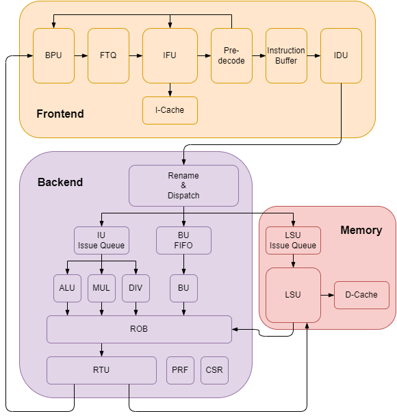
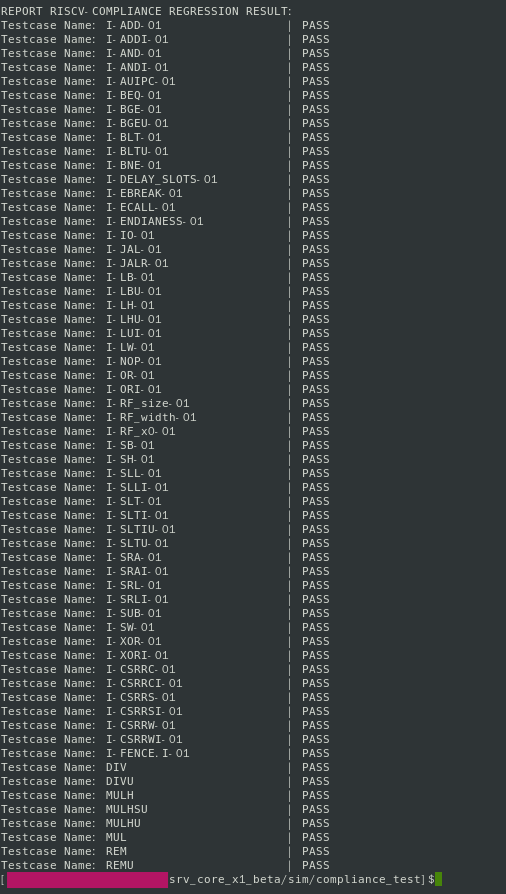
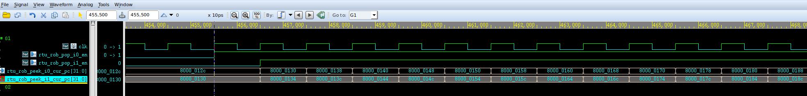
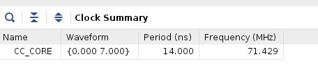
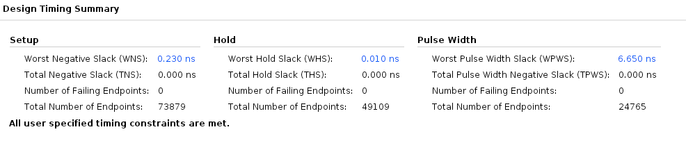
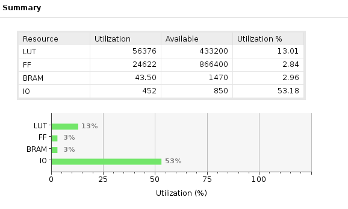
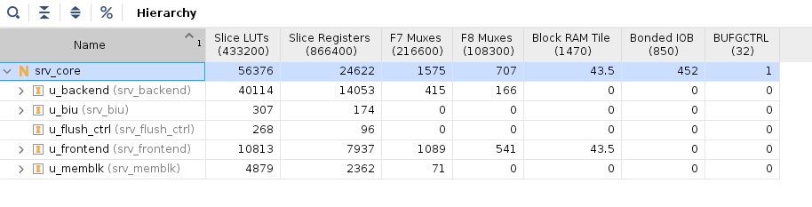

# SRV_CORE_X1 --- RISC-V 32-bit 乱序超标量 CPU

Github: [https://github.com/majx1996/srv_core_x1_beta.git](https://github.com/majx1996/srv_core_x1_beta.git)

**注：该仓库并非项目主仓库，仅用于展示**



## 特性
* RISC-V 32-bit CPU core，支持 IM 指令集（RV32IM），仅支持机器模式
* 乱序执行，译码宽度为 2
* 基于局部历史的分支预测（BTB+BHT+PHT），分支预测与取指单元解耦
* 统一的 PRF 寄存器重命名
* 5 组执行部件：ALU、MUL、DIV、BU（分支指令处理单元）、LSU
* 保守的乱序访存策略：读写之间顺序、写之间顺序、读之间乱序
* 支持 IO 访存和 Normal Memory 访存，IO 访存强制顺序
* Store 请求和 IO 访存请求一旦从总线发出，对应指令不会被冲刷掉

## 代码风格

- 完全采用可综合的 SystemVerilog 语法，支持 FPGA 综合
- 灵活的参数化：包括各级时序参数、buffer 深度、总线 outstanding 能力、ROB 项数、物理寄存器个数、各区域地址段等
- 模块间通过 valid & ready 握手实现数据传输，最大化解耦

## 文件介绍
1. doc：ReadMe 图片
2. riscv-compliance：RISC-V 一致性测试用例，包含汇编源代码和用于最终比对的参考数据
3. rtl：srv_core_x1 的 systemverilog RTL 代码，进一步测试且稳定后将开源所有加密代码，代码状态见下表
4. script：主要包含运行一致性测试用的脚本环境
5. sim：用于一致性测试的 testbench
6. 开源除法器地址：https://github.com/OpenXiangShan/XS-Verilog-Library.git

| 目录                          | 说明                                           | 状态        |
| ----------------------------- | ---------------------------------------------- | ----------- |
| bus                           | ICB 总线组件                                   | 未加密      |
| cache                         | CACHE，目前仅实现 ICACHE                       |             |
| core/backend                  | 流水线后端，包含 RR/DISP/IQ/FU/CSR/PRF/ROB/RTU |             |
| core/frontend                 | 流水线前端，包含 BPU/FIU/IDU                   |             |
| core/memblk                   | 访存子系统                                     |             |
| core/package                  | srv_core_x1 参数配置包文件                     |             |
| core/sideband                 | 非流水线的其他单元                             |             |
| gnrl                          | 通用单元，包含 FIFO 等基本组件                 |             |
| import/XS-Verilog-Library-DIV | 香山处理器项目库的除法器                       | 未加密/导入 |
| top                           | 若干顶层 TOP 文件                              | 未加密      |

## 状态

目前已在使用 ITCM 和 DTCM 的情况下调试完 RISC-V IM 一致性兼容测试用例，地址空间配置均为 non-cacheable、非 IO region。

不支持的测试用例如下：

| 用例                 | 说明                                                         |
| -------------------- | ------------------------------------------------------------ |
| I-MISALIGN_JMP-01.S  | srv_core_x1 不支持非对齐取指                                 |
| I-MISALIGN_LDST-01.S | 该用例期望 CPU 发起非对齐地址访存后能上报异常，srv_core_x1 支持非对齐访存，不需要上报异常 |

## 运行仿真

### 工具链需求

1. riscv32-unknown-elf-gcc：编译器
2. riscv32-unknown-elf-objcopy：提取二进制文件中的段
3. riscv32-unknown-elf-objdump：反汇编，用于 debug
4. spike：RISC-V 模拟器，用于 debug，不需要 pk，裸机跑程序
5. vcs：仿真编译器
6. verdi：波形查看

### 会占用的环境变量和命令别名(alias)

1. 环境变量：SRV_CORE_HOME
2. 环境变量：proj
3. 环境变量：dumpfsdb
4. 命令别名：run
5. 命令别名：wave
6. 命令别名：run_compliance

### 运行单个测试

1. 在仓库根目录下 source 环境变量
2. cd 至 $SRV_CORE_HOME/sim/compliance/ 目录
3. 将 Makefile 中 testcase 变量修改为所需用例，也可通过命令行传参
4. 运行 make 命令，构建测试用例需要的二进制文件等
5. 运行 run 命令，启动 vcs 编译和运行
6. 运行 wave 命令，打开波形

```
source SourceMe
cd sim/compliance_test
make testcase=I-ADD-01
run
wave
```

### 运行所有测试用例

1. 在仓库根目录下 source 环境变量
2. cd 至 $SRV_CORE_HOME/sim/compliance/ 目录
3. 运行 run_compliance 命令，测试所有测试用例

```
source SourceMe
cd sim/compliance_test
run_compliance
```

### 测试截图

一致性测试结果：




仿真截图(指令退休)：



## FPGA 综合

时钟约束 71.429MHz，input/output delay 为 0.4*14ns，暂时没有采用 Block Memory 构建存储器，还有提升空间








